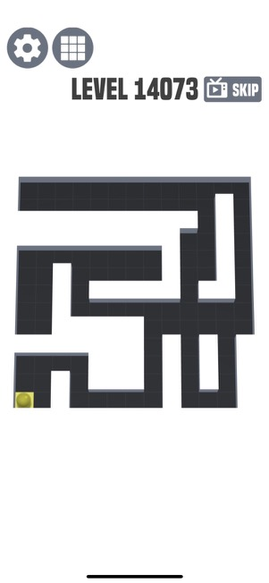
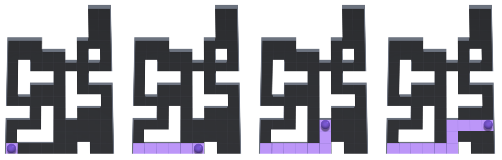

# AmazeSolver

There is a pretty fun game called "Amaze!!!", [iOS link](https://itunes.apple.com/us/app/amaze/id1452526406?mt=8), in which the premise is to cover a full game board with paint. 

I have been playing it somewhat obsessively while traveling for the past few months (as seen by the fact that I'm on level 14073 - don't mind that, though, as the levels actually reset and wrap around to the beginning after a hundred or so, which was a disappoinment).

I wanted to see if I could come up with an algorithm and representation of the game in Python.

## Rules

You start as a ball placed on the grid. You can swipe in 4 directions - up, down, left and right. 

You travel as far on the grid as possible in that direction. Below you can see the progression of 4 turns. 

Initial board, a move right, a move up, and a move right.

The goal is to completely cover the board in paint.

The game itself is trivial (and in fact I wish it was harder, perhaps a limitation on the number of moves, or the amount of paint you can lay down, or a timer). So trivial, in fact, that I recreated it in javascript to play around with it. I adapted some of the code from [here](http://jsfiddle.net/n8j1s/4y22135r/) and made it a little more functional and changed it to Amaze!!!.  

I wanted to see how easy it would be to build an AI that would A) solve the puzzle and B) see if I could find a way to actually find the *optimal* solution. The latter seems significantly more difficult than the former.

Note: After giving this some more thought I realized it's just a modification of the traveling salesman problem... What a bummer, to find out the problem you're trying to find an optimal solution to is NP hard. 

Every move you make takes you to a new destination. You have to visit every node once (I *think*, still not completely sure; for instance, if a nodes nodes location is on the path of two other nodes, you don't need to visit that node, but you might have to visit that node to clear the blocks on that nodes path?).

We can model this as a directed graph, which you can see below